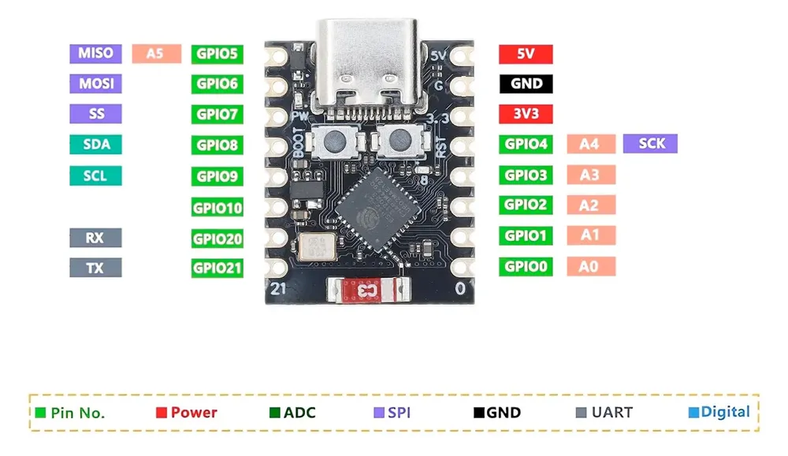

# Project 01

## Components

- ESP32 C3 Super Mini

    Pin diagrams:
    
    

    Source: https://done.land/components/microcontroller/families/esp/esp32/developmentboards/esp32-c3/c3supermini/

- TFT 1.8 inch (ST7735)

    Pin wiring:

    | ST7735 | ESP32 C3 |
    | ------ | -------- |
    | VCC    | 3V3      |
    | GND    | GND      |
    | CS     | 10 / 7   |
    | RESET  | 9        |
    | A0(DC) | 8        |
    | SDA    | 6        |
    | SCK    | 4        |
    | LED    | 3V3      |

    **The screen is either black or green board.**

- MAX30102 (Sensor)

## Libraries

- Adafruit_ST77xx
- Adafruit_GFX
- TFT_eSPI (Fallback for Adafruit)

## References

- https://www.makerguides.com/interface-tft-st7735-display-with-esp32/
- https://forum.arduino.cc/t/esp32-c3-and-tft-128x160-st7735/1406946/9
- https://www.espboards.dev/esp32/esp32-c3-super-mini/